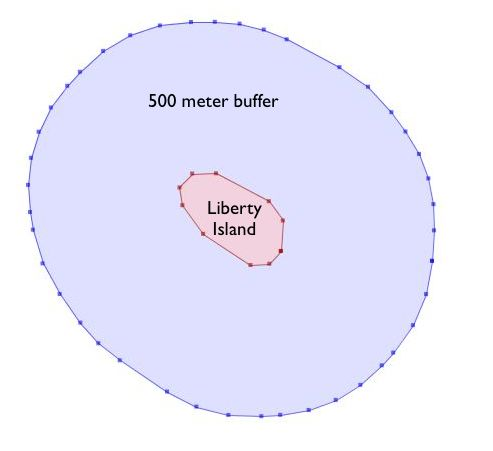
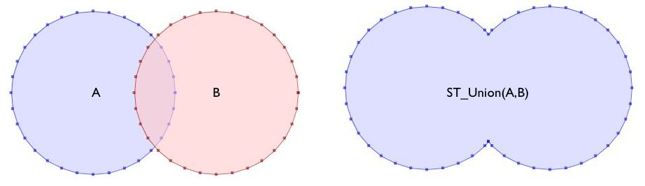

.. _geometry_returning:

Partie 18 : Fonctions de construction de géométries
====================================================

Toute les fonctions que nous avons vues jusqu'à présent traitent les géométries "comme elles sont" et retournent: 
 
* une analyse des objets (:command:`ST_Length(geometry)`, :command:`ST_Area(geometry)`), 
* une sérialisation des objets (:command:`ST_AsText(geometry)`, :command:`ST_AsGML(geometry)`), 
* une partie de l'objet (:command:`ST_RingN(geometry,n)`) ou
* un résultat vrai/faux (:command:`ST_Contains(geometry,geometry)`, :command:`ST_Intersects(geometry,geometry)`).

Les "fonctions de construction de géométries" prennent des géométries en entrée et retournent de nouvelles formes.

ST_Centroid / ST_PointOnSurface
-------------------------------

Un besoin commun lors de la création de requêtes spatiales est de remplacer une entité polygonale par un point représentant cette entité. Cela est utile pour les jointures spatiales (comme indiqué ici : :ref:`polypolyjoins`) car utiliser :command:`ST_Intersects(geometry,geometry)` avec deux polygones impliquera un double comptage : un polygone pour le contour externe intersectera dans les deux sens; le replacer par un point le forcera à être dans un seul sens, pas les deux.

 * :command:`ST_Centroid(geometry)` retourne le point qui est approximativement au centre de la masse de la géométrie passé en paramètre. C'est un calcul simple et rapide, mais parfois peu intéressant, car le point retourné peut se trouver à l'extérieur de l'entité elle-même. Si l'entité fournie est convexe (imaginez la lettre 'C') le centroïde renvoyé pourrait ne pas être à l'intérieur du polygone.
 * :command:`ST_PointOnSurface(geometry)` retourne un point qui est obligatoirement dans l'entité passée en paramètre. Cette fonction coûte plus cher en ressource que le calcul du centroïd.
 
.. image:: ./geometry_returning/centroid.jpg

ST_Buffer
---------

L'opération de zone tampon est souvent disponible dans les outils SIG, il est aussi disponible dans PostGIS. La fonction :command:`ST_Buffer(geometry,distance)` prend en paramètre une géométrie et une distance et retourne une zone tampon dont le contour est à une distance donnée de la géométrie d'origine.

.. image:: ./geometry_returning/st_buffer.png

Par exemple, si les services des parcs américains souhaitaient renforcer la zone du trafic maritime autour de l'île 'Liberty', ils pourraient construire une zone tampon de 500 mètres autour de l'île. L'île de 'Liberty' est représenté par un seul bloc dans notre table ``nyc_census_blocks``, nous pouvons donc facilement réaliser ce calcul. 

.. code-block:: sql

  -- Création d'une nouvelle table avec une zone tampon de 500 m autour de 'Liberty Island'
  CREATE TABLE libery_island_zone AS
  SELECT ST_Buffer(the_geom,500) AS the_geom 
  FROM nyc_census_blocks 
  WHERE blkid = '360610001009000';

  -- Mise à jour de la table geometry_columns
  SELECT Populate_Geometry_Columns(); 
  

La fonction :command:`ST_Buffer` permet aussi d'utiliser des valeur négative pour le paramètre distance et construit un polygone inclus dans celui passé en paramètre. Pour les points et les lignes vous obtiendrez simplement un résultat vide.

.. image:: ./geometry_returning/liberty_negative.jpg

ST_Intersection
---------------

Une autre opération classique présente dans les SIGs - le chevauchement - crée une nouvelle entité en calculant la zone correpondant à l'intersection de deux polygones superposés. Le résultat a la propriété de permettre de reconstruire les entité de base à l'aide de ce résultat.

La fonction :command:`ST_Intersection(geometry A, geometry B)` retourne la zone géographique (ou une ligne, ou un point) que les deux géométries on en commun. Si les géométries sont disjointes, la fontion retourne une géométrie vide.

.. code-block:: sql

  -- Quelle est l'aire que ces deux cercles ont en commun ?
  -- Utilisons la fonction ST_Buffer pour créer ces cercles !
  
  SELECT ST_AsText(ST_Intersection(
    ST_Buffer('POINT(0 0)', 2),
    ST_Buffer('POINT(3 0)', 2)
  ));

.. image:: ./geometry_returning/intersection.jpg

ST_Union
--------

Dans l'exemple précédent nous intersections des géométries, créant une nouvelle géométrie unique à partir de deux entités. La commande :command:`ST_Union` fait l'inverse, elle prend en paramètre des géométries et assemble les parties communes. Il y a deux versions possibles de la fonction  :command:`ST_Union` : 

 * :command:`ST_Union(geometry, geometry)`: une version avec deux paramètres qui prend les géométries et rentourne l'union des deux. Par exemple, nos deux cercles ressemblent à ce qui suit si nous utilisons l'opération union plutôt que l'intersection.

.. code-block:: sql

     -- Quelle est l'aire totale des ces deux cercles ?
     -- Utilisons ST_Buffer pour créer les cercles !
 
     SELECT ST_AsText(ST_Union(
       ST_Buffer('POINT(0 0)', 2),
       ST_Buffer('POINT(3 0)', 2)
     ));
  

:

 * :command:`ST_Union([geometry])`: une version agrégat qui prend un ensemble de géométries et retourne une géométrie contenant l'ensemble des géométries rassemblées. La fonction agrégat ST_Union peut être utilisé grâce au SQL ``GROUP BY`` pour créer un ensemble rassemblant des sous-ensembles de géométries basiques. Cela est très puissant,

Par exemple avec la fonction d'agrégation  :command:`ST_Union`, considèrons notre table ``nyc_census_blocks``.  La table de géographique du recensement est construite avec attention, afin de pouvoir reconstruire les entités de niveau supérieur à partir des entités de base. Ainsi, nous pouvons créer des cartes de reconsement en regroupant les blocs pour chaque zone de recensement (comme cela est fait ensuite dans :ref:`creatingtractstable`). Ou alors nous pouvons créer une carte des cantons en faisant l'union des blocs qui les composent.

Pour créer cette fusion, il faut remarquer que la clé unique ``blkid``  contient en fait des informations sur les niveaux géographiques. Voice les parties de l'identifiant pour Liberty Island, que nous avons utilisées plus tôt:

::

  360610001009000 = 36 061 00100 9000
  
  36     = State of New York
  061    = New York County (Manhattan)
  000100 = Census Tract
  9      = Census Block Group
  000    = Census Block
  
Ainsi, nous pouvons créer une carte des cantons en fusionnant toutes les géométries qui partagent les 5 même premiers chiffres de leur clé ``blkid``.

.. code-block:: sql

  -- Création d'une table nyc_census_counties en regroupant les blocs
  CREATE TABLE nyc_census_counties AS
  SELECT 
    ST_Union(the_geom) AS the_geom, 
    SubStr(blkid,1,5) AS countyid
  FROM nyc_census_blocks
  GROUP BY countyid;
  
  -- Mise à jour de la table geometry_columns
  SELECT Populate_Geometry_Columns();
  
.. image:: ./geometry_returning/union_counties.png

Un test d'aire confirme que notre opération d'union ne nous a fait perdre aucune géométrie. Premièrement, nous calculons l'aire de chaque bloc de recensement, et ous faisons la somme de ces surfaces en les regroupant par identifiant de canton de recensement.

.. code-block:: sql

  SELECT SubStr(blkid,1,5) AS countyid, Sum(ST_Area(the_geom)) AS area
  FROM nyc_census_blocks 
  GROUP BY countyid;

::

  countyid |       area       
 ----------+------------------
  36005    | 109807439.720947
  36047    | 184906575.839355
  36061    | 58973521.6225586
  36081    | 283764734.207275
  36085    | 149806077.958252

Ensuite nous calculons l'aire de chaque zone de nos nouveaux polygones de régions de la table count :

.. code-block:: sql

  SELECT countyid, ST_Area(the_geom) AS area
  FROM nyc_census_counties;

::

  countyid |       area       
 ----------+------------------
  36005    | 109807439.720947
  36047    | 184906575.839355
  36061    | 58973521.6225586
  36081    | 283764734.207275
  36085    | 149806077.958252

La même réponse ! Nous avons construit avec succès une table des régions de NYC à partir de nos données initiales.

Liste des fonctions
-------------------

`ST_AsText(text) <http://postgis.org/docs/ST_AsText.html>`_: retourne la représentation Well-Known Text (WKT) de la geometry/geography sans métadonnée SRID.

`ST_Buffer(geometry, distance) <http://postgis.org/docs/ST_Buffer.html>`_: Retourne une géométrie qui représente tous les points dont la distance à partir de la géométrie d'origine est inférieure ou égale à la distance donnée. Les calculs sont fait dans le système de coordonnées de référence.

`ST_Intersection(geometry A, geometry B) <http://postgis.org/docs/ST_Intersection.html>`_: Retourne une géométrie qui représente la partie en commun de la géométrie A et de la géométrie B. 

`ST_Union() <http://postgis.org/docs/ST_Union.html>`_: Retourne une géométrie qui représente l'union de l'ensemble des points des géométries.

`substring(string [from int] [for int]) <http://www.postgresql.org/docs/8.1/static/functions-string.html>`_: Fonction PostgreSQL qui extrait la sous chaine correspondant aux critères donnés.

`sum(expression) <http://www.postgresql.org/docs/8.2/static/functions-aggregate.html#FUNCTIONS-AGGREGATE-TABLE>`_: Fonction agrégat PostgreSQL qui retourne la somme des valeurs d'un champ pour le groupe. 
